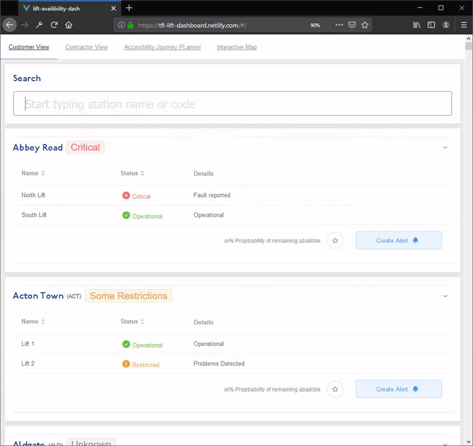

# 
 TfL & National Rail Live Lift Status API & Dashboard 

&nbsp;

## 
🏆   Winners of [InfraHack 2019](http://infrahack.hackpartners.com/) winning Network Rail & TfL challenges   🏆

&nbsp;

## The Problem: 
Currently, users with reduced mobility have ***no access*** to live lift information for UK wide rail stations and Transport for London operated stations.  

&nbsp;

## Our Solution: 
We mapped a large amount of data from TfL and Network Rail spreadsheets and databases and created an API to aggregate this data and serve it as a publicly accessible endpoint. Alongside this, we explored the use of applied computer vision on real-time CCTV footage to detect when issues on the escalators and lifts occurred, and then display the results on a dashboard. We thought this could be particularly useful for customers with reduced mobility, who are reliant on the lifts being operational. It could also be useful for the maintainers, to understand which lifts are out of service and have the highest demand at present.

&nbsp;

## Future Ideas: 
Unfortunately, due to the nature of hackathons, we didn't have enough time to implement our other ideas. Some things we considered for the future were:

1.  Calculating the ***probability*** of lift failure, applying regressional techniques to historical data.
2.  Giving customers alternative routes based on lift availability and routing from TfL.

&nbsp;

## Screenshots

#### Detecting people using the elevators and lifts

